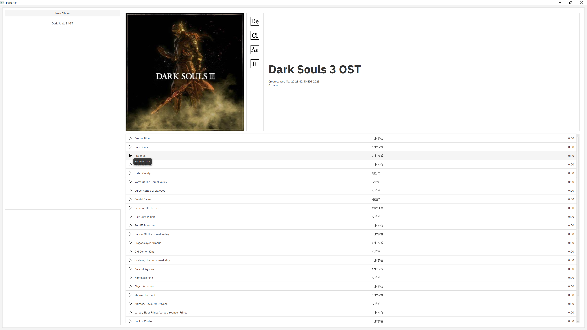
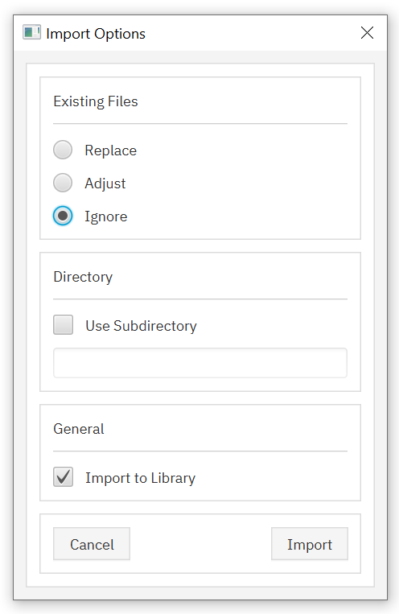
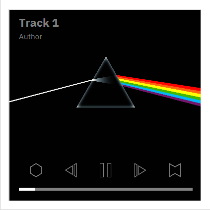

# Firestarter

Shield: [![CC BY-NC-SA 4.0][cc-by-nc-sa-shield]][cc-by-nc-sa]

## Overview

Firestarter is a music library UX prototype made with [JavaFX](https://openjfx.io).
Audio playback functionality is limited to WAV files. Album data does not persist
between sessions.

Albums may be created and named as necessary, and support importing audio files. Audio
file metadata is read using the [JAudioTagger](https://www.jthink.net/jaudiotagger/examples.jsp)
library.

## Visuals

A screenshot of the whole application window:

Note: The album controls (listed vertically between the album art and the album title)
will delete the album [De], change its icon [Ci], rename it [Aa], or add (import) tracks [It]

Audio file import dialog:

Audio player controls:

Note: These controls look nicer than they are intuitive

Note: The audio player controls will appear in the bottom left of the full application window (the first screenshot does not display this) 

## License

This work is licensed under a
[Creative Commons Attribution-NonCommercial-ShareAlike 4.0 International License][cc-by-nc-sa].

[![CC BY-NC-SA 4.0][cc-by-nc-sa-image]][cc-by-nc-sa]

[cc-by-nc-sa]: http://creativecommons.org/licenses/by-nc-sa/4.0/
[cc-by-nc-sa-image]: https://licensebuttons.net/l/by-nc-sa/4.0/88x31.png
[cc-by-nc-sa-shield]: https://img.shields.io/badge/License-CC%20BY--NC--SA%204.0-lightgrey.svg
